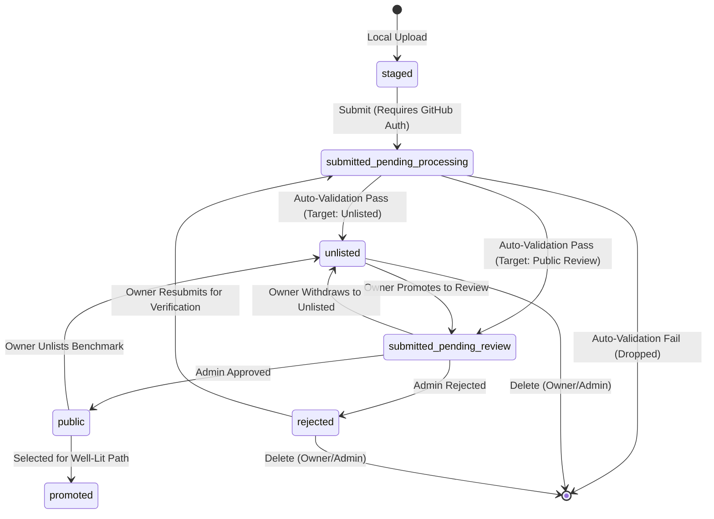
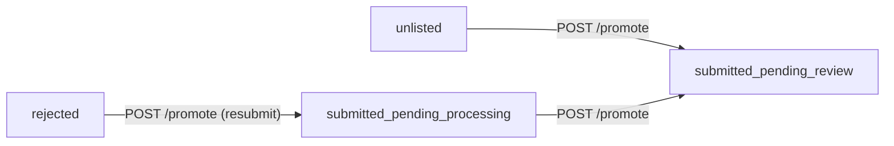
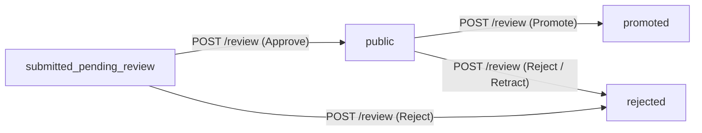
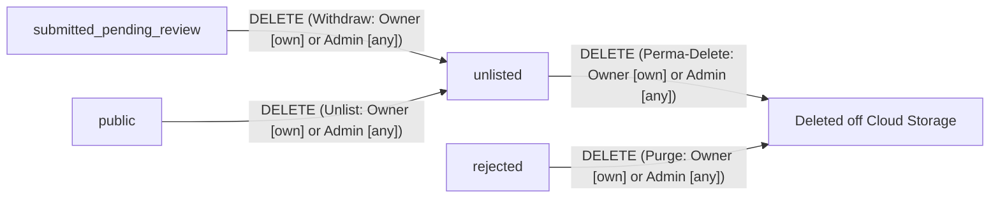

# Prism Cloud Benchmark Upload API Schema & Reference

This document serves as the **source of truth** for the **internal Prism
database format** and upload payload object structure.

> [!IMPORTANT]
>
> **Prism internal schema differs from raw BRV0.2**: This schema is optimized
> for Prism backend storage, indexing, and querying. It does not directly mirror
> the raw output format of upstream `llm-d-benchmark` reports (e.g., hardware
> accelerator definitions may be mapped differently).

Both frontend client state-building/editing components and backend
validation/ingestion endpoints (Prism Community Store BFF) must adhere to the
data contract outlined below.

---

## 1. High-Level Pipeline Overview

When a user stages benchmark files (locally or via GCS/S3 buckets), folders are
parsed and bundled at the **Run Level** into a single cohesive payload. Each
payload contains:

1. **Root-Level Metadata:** Descriptive parameters about the overall benchmark
   run (e.g., model name, hardware accelerator, run identifiers).
2. **Supplemental Manifests & Logs:** Secondary configuration, environment, and
   verification files (e.g., GKE deployment YAML manifests, execution logs). For
   auto-detection, `data:` URI encoding, and ZIP export unpacking details, refer
   to the dedicated [Auto-Handling Specification](auto_log_handling.md).
3. **Stages Array (`entries`):** One or more benchmarking runs corresponding to
   sequential execution stages of the target scenario (formatted under
   **Benchmark Report v0.2**).

---

## 2. Combined API Payload Schema

The API payload structure is defined by the following key entities:

- `PrismResultPayload`: Root container representing the JSON payload content
  stored inside a result file inside the bucket.
- `PrismResultContext`: Describes the GCS custom metadata context of a benchmark
  result.
- `PrismStageEntry`: Represents an individual benchmark stage entry nested
  inside the parent run bundle.

---

## 3. Benchmark Report v0.2 (BRV02) Reference

The `raw_report` field contains the parsed Benchmark Report v0.2 structure.
Instead of maintaining a duplicate TypeScript definition here, refer to the
upstream repository:

- **Documentation:**
  [Benchmark Report README](https://github.com/llm-d/llm-d-benchmark/blob/main/llmdbenchmark/analysis/benchmark_report/README.md)
- **JSON Schema:**
  [br_v0_2_json_schema.json](https://github.com/llm-d/llm-d-benchmark/blob/main/llmdbenchmark/analysis/benchmark_report/br_v0_2_json_schema.json)
    - _Note:_ The JSON schema is historically too strict for practical
      ingestion. Prism treats all fields in this schema as optional/partial by
      default to handle missing or incomplete metrics gracefully.
- **Canonical Example:**
  [br_v0_2_example.yaml](https://github.com/llm-d/llm-d-benchmark/blob/main/llmdbenchmark/analysis/benchmark_report/br_v0_2_example.yaml)
- **Prism Parsing & Data Model Spec:** For detailed specifications on how
  individual BRV0.2 files are parsed, grouped into runs, normalized, and
  enriched with fallback metadata, refer to the dedicated
  [Parser & Data Model Specification](parser_and_data_model.md).
- **Unit Handling & Normalization Spec:** For detailed specifications on how
  latency and throughput units are parsed, converted to milliseconds, defaulted
  upon omission, and validated against suspicious values, refer to the dedicated
  [Unit Handling Specification](unit_handling.md).

---

## 4. Ingestion & Validation Rules

### 4.1 Format Verification (`validateFormat`)

- A valid file must contain `"version": "0.2"` or `"schema": "v0.2"`, or contain
  top-level structures for `run`, `scenario`, and either `metrics` or `results`.
- Parsed files are verified as **brv02** reports.

### 4.2 Complete Upload Structure Verification (`validatePrismUploadStructure`)

The shared isomorphic parser validates a complete bundle under the following
criteria:

1. **Root Fields Check:**
    - `format` must be exactly `"brv02"`.
    - `model_name` must be present and not `'Unknown'`.
    - When uploading to the cloud (`isUpload: true`), `hardware.hardware_name`
      must be present and not `'Unknown'` or `'Unknown Hardware'`.
2. **Stage Consistency Checks:**
    - Every stage entry in the `entries` array is parsed and analyzed.
    - **Model Consistency:** The model parsed from each stage report must
      exactly match the root-level `model_name`.
    - **Hardware Consistency:** The hardware parsed from each stage report must
      exactly match the root-level `hardware.hardware_name`.
    - **Run UID Integrity:** If specified, the stage's internal `run.uid` must
      match `entry.run_uid`.
3. **Metric Integrity Validation:**
    - Rejects any stage with zero or negative performance metrics (e.g.,
      throughput <= 0, or E2E request latency <= 0).

### 4.3 Fallback and Enrichment Flow

To build complete metadata profiles when raw stage files contain missing
parameters:

- **Directory Harvesting:** The uploader groups staged files by parent
  directory. If files are accompanied by `run_metadata.yaml` or `config.yaml`,
  these are scraped first.
- **Hardware Backfilling:** If `scenario.stack` lacks accelerator info, the
  parser reads `run_metadata.accelerator` or checks
  `config.kustomize.acceleratorBackend` to resolve and backfill the hardware
  parameters.
- **Engine/Tool Scraping:** Standard inference engine identities (e.g., `vllm`,
  `tgi`, `sglang`) and tool versions are automatically scraped from the first
  valid stage's component stack to pre-populate root-level fields.

---

## 5. ID Strategy & Ingestion Schema Decisions

- **Parser Autonomy:** The `BenchmarkReportV02` parser (`parseReportV02.js`)
  does **not** roll new run IDs or generate synthetic UUIDs for parsed report
  files. It preserves the original `run.uid` as `runUid` (kept original as-is).
- **Attribution & Comparisons:** Prism does not trust or rely on user/tool
  generated IDs (like `run.uid` from raw reports) for unique comparisons or
  entity mapping. It uses its own generated UUIDs.

---

## 6. Submission Lifecycle & State Machine

This section defines the states a benchmark run can traverse during its
lifecycle from local upload to public availability.

### 6.1 Status Definitions

Submission status is determined from the GCS object metadata context
(`submission_state` key) or browser local storage:

| Const Name                     | Human Name         | Stored Location     | Explanation                                                                                         | Possible Next States                                                                 |
| :----------------------------- | :----------------- | :------------------ | :-------------------------------------------------------------------------------------------------- | :----------------------------------------------------------------------------------- |
| `staged`                       | Staged (Local)     | Browser (IndexedDB) | Benchmark stored locally in the browser for previewing prior to cloud upload.                       | **Up:** `submitted_pending_processing`<br>**Down:** `[*]` (Discard)                  |
| `submitted_pending_processing` | Pending Processing | GCS Results Store   | Uploaded benchmark undergoing automated schema validation and sanity checks.                        | **Up:** `unlisted`, `submitted_pending_review`<br>**Down:** `[*]` (Dropped on error) |
| `submitted_pending_review`     | Pending Review     | GCS Results Store   | Validated benchmark queued for admin review. Visible only to admins and the submitting owner.       | **Up:** `public`, `promoted`<br>**Down:** `unlisted` (Withdraw), `rejected` (Reject) |
| `unlisted`                     | Unlisted           | GCS Results Store   | Cloud-stored benchmark accessible via direct link or explicit filter, skipping public human review. | **Up:** `submitted_pending_review` (Promote)<br>**Down:** `[*]` (Perma-Delete)       |
| `public`                       | Public             | GCS Results Store   | Reviewed and approved benchmark visible to all users across general exploration lists.              | **Up:** `promoted`<br>**Down:** `unlisted` (Unlist), `rejected` (Retract)            |
| `promoted`                     | Public (Promoted)  | GCS Results Store   | Public benchmark highlighted as part of a canonical Well-Lit Path stack configuration.              | **Up:** None<br>**Down:** `public`, `unlisted` (Unlist), `rejected` (Retract)        |
| `rejected`                     | Rejected           | GCS Results Store   | Benchmark rejected during admin review with optional reviewer feedback attached.                    | **Up:** `submitted_pending_processing` (Resubmit)<br>**Down:** `[*]` (Purge)         |

### 6.2 State Transitions



- Permissions & Authentication:
    - `staged`: Open to all (no login required).
    - `submitted_pending_processing`: Requires GitHub OAuth. Only allowlisted
      users can submit.
    - `unlisted`: Skips human review. Readable by everyone (not secret), but
      hidden by default from public explore unless queried explicitly or
      accessed via share link. For full design details, see
      [unlisted-benchmarks-spec.md](../../changes/unlisted-benchmarks-spec.md).
    - `unlisted` -> `submitted_pending_review`: Performed exclusively by the
      **submitting user (owner ONLY)** via `POST /api/results/:runId/promote`.
      Admins cannot promote other users' benchmarks.
    - `submitted_pending_review`: Visible only to **Admins** (all pending runs)
      and the **submitting owner** (their own pending runs).
    - `submitted_pending_review` -> `public` / `rejected`: Requires Admin
      privileges via `POST /api/results/:runId/review`.
    - `submitted_pending_review` / `public` -> `unlisted`: Performed by the
      **submitting user (owner)** or **admin** via `DELETE /api/results/:runId`
      (double-delete withdrawal flow).
    - `unlisted` / `rejected` -> permanent deletion: Performed by the
      **submitting user (owner)** or **admin** via `DELETE /api/results/:runId`.

### 6.3 Synchronous vs. Asynchronous Validation

While the state machine defines `submitted_pending_processing` as an automated
processing queue state, to simplify the infrastructure footprint during the
early beta:

1. **Synchronous Execution**: The backend web server runs the validation logic
   synchronously inside the request lifecycle immediately after the raw upload
   is staged in GCS.
2. **Immediate Promotion / Unlisting**: If validation passes, the run is
   promoted to either `unlisted` or `submitted_pending_review` depending on the
   submitter's selected visibility mode (`targetState`). If validation fails,
   the item is completely dropped/deleted from cloud storage and an HTTP 400
   error is returned to the client. The `rejected` queue is reserved exclusively
   for manual admin rejections.
3. **Future Decoupling**: The processing wrapper is fully decoupled. In the
   future, the synchronous invocation can be removed in favor of an asynchronous
   background worker (e.g., GCS Object Eventarc trigger or Pub/Sub pull worker
   calling the same processing library). background worker (e.g., GCS Object
   Eventarc trigger or Pub/Sub pull worker calling the same processing library).

---

## 7. Cloud Storage & Metadata Architecture

This section describes the storage backend using Google Cloud Storage (GCS).

### 7.1 Bucket Architecture

The Results Store bucket is configured via the `RESULTS_STORE_BUCKET`
environment variable (falling back to the first entry of `DEFAULT_BUCKETS` or
`llm-d-benchmarks` if unset):

- **Staging / Development Bucket
  (`gs://llm-d-benchmarks-staging/prism-results-store/*`):**
    - **Local Dev / Staging Environment
      (`RESULTS_STORE_BUCKET=llm-d-benchmarks-staging`):** Managed wholly inside
      this bucket. Stores all benchmark uploads AND approvals (across all
      states).
- **Production Bucket (`gs://llm-d-benchmarks/prism-results-store/*`):**
    - **Production Environment (`RESULTS_STORE_BUCKET=llm-d-benchmarks`):**
      Managed wholly inside this bucket. Stores all benchmark uploads AND
      approvals (across all states).
- **IAM Configuration Files (`gs://<RESULTS_STORE_BUCKET>/prism-iam/*`):**
    - Stored within the active Results Store bucket for access control files.

### 7.2 File Pathing

Runs are stored as single JSON files using the following format:

```
gs://<bucket_name>/prism-results-store/<benchmarkID>.v1.json
```

- `<benchmarkID>` is the unique ID (UUIDv4) of the run.
- `.v1.json` extension is used to allow future format versions while maintaining
  backward compatibility.

### 7.3 Metadata & Object Contexts

Since GCS is the primary store (prior to database migration), object metadata is
stored using GCS Object Contexts (arbitrary key-value pairs attached to objects)
to allow listing and filtering without reading the file contents.

> [!IMPORTANT]
>
> **Status is determined by metadata**: The submission status is solely
> determined by the `submission_state` key in the GCS object metadata context,
> not by the bucket in which the file resides.

- **Maximum Contexts:** 50 keys per object.
- **Custom Metadata Contexts:**

| GCS Context Key    | Required | Base64url Encoded? (Prefix `e`) | Description                                                                                |
| :----------------- | :------- | :------------------------------ | :----------------------------------------------------------------------------------------- |
| `submission_state` | Yes      | **No**                          | The submission status (e.g. `public`, `unlisted`, `rejected`, `submitted_pending_review`). |
| `github_user`      | Yes      | **No**                          | The GitHub username of the contributor (for attribution).                                  |
| `run_id`           | Yes      | **No**                          | The unique run identifier (UUIDv4).                                                        |
| `hardware_name`    | No       | **Yes**                         | Normalized accelerator name (e.g. `TPU v6e`).                                              |
| `model_name`       | No       | **Yes**                         | Normalized model name (e.g. `meta-llama/Llama-3-8B-Instruct`).                             |
| `run_label`        | No       | **Yes**                         | Human-friendly run description label.                                                      |
| `feedback`         | No       | **Yes**                         | Feedback reason for rejection/changes requested.                                           |
| `well_lit_path`    | No       | **Yes**                         | Selected "Well-Lit Path" optimization classification.                                      |

### 7.4 GCS Listing & Pagination Strategy (Logical Operator Workaround)

GCS's native list filtering API does not support combining multiple query
conditions with logical operators (such as `AND` or `OR`). To work around this
constraint while keeping GCS-side filtering fast and optimized:

1. **Backend Server-Side Optimization:** The backend translates standard list
   requests with `own=true` or a specific status filter directly into GCS-side
   query filter params (e.g. `contexts."github_user"="username"` or
   `contexts."submission_state"="public"`), letting the GCS server perform the
   filtering.
2. **Client-Side Split-Listing Strategy:** To display a unified dashboard with
   both the user's own benchmarks (staged/unlisted/pending/processing/etc.) and
   public approved benchmarks:
    - The frontend client fires two separate listing requests to the backend
      with separate query params and pagination strings (e.g. one for `own=true`
      and another for `status=public` / `status=promoted`).
    - Unlisted benchmarks belonging to other users are excluded from standard
      public listing requests (`status=public`), but can be retrieved directly
      by their UUID via `GET /api/results/:runId`.
    - The frontend displays the user's own benchmarks on top. It lists the
      current user's benchmarks until exhausted, then paginates/transitions to
      listing the public ones.

---

## 8. Access Control & Authorization (Allowlists)

Prism uses **GitHub OAuth** for user authentication, benchmark contributor
attribution, and authorization:

- **Authentication:** Benchmark submissions require contributors to log in via
  GitHub OAuth. The user's active access token is passed in the
  `X-Prism-Github-Token` header.
- **Attribution:** The authenticated user's GitHub username is stored as
  metadata on GCS benchmark upload files (`user` key) to track attribution.
- **Role Resolution:** Prism resolves permissions by checking organization
  membership under the `llm-d` organization, and fallback GCS-based user/admin
  allowlists.

For the detailed validation flow, allowlist structure, and management tools,
please refer to the dedicated [iam.md](iam.md) file.

### 8.1 GitHub App Setup

Prism relies on a dedicated GitHub App to manage OAuth connections. For
instructions on how to initialize and configure the application, redirect
callback URLs, and configure the necessary organization permissions, see the
[GitHub OAuth Setup Guide](../../../docs/github-oauth-setup.md).

---

## 9. Future Database Architecture (WIP)

To support scaling beyond GCS object context limits (50 keys max, pagination
issues), a database migration (e.g., BigQuery or Spanner) is planned.

- **Requirements:**
    - Latency < 10 seconds for listing and filtering > 100k benchmarks.
    - Full support for pagination.
    - Support for batch processing raw data for well-lit path analysis.

---

## 10. API Routes & Endpoint Reference

### 10.1 Lifecycle & Directional State Flow Diagrams

#### 1. `POST /api/results/:runId/promote` (Promote Up)

Moves submissions **UP** the lifecycle. Invoked by the **submitting owner ONLY**
(admins cannot promote other users' benchmarks).



#### 2. `POST /api/results/:runId/review` (Admin Review)

Handles **review decisions** (approval, promotion, or rejection). Invoked by
**administrators ONLY**.



#### 3. `DELETE /api/results/:runId` (Demote Down & Permanent Deletion)

Moves submissions **DOWN** (withdrawal/unlisting back to `unlisted`) or
**permanently purges** data off GCS (`unlisted` / `rejected`).

- **Owner:** Can withdraw, unlist, or delete **their own** submissions.
- **Admin:** Can withdraw, unlist, or delete **any** submission.



### 10.2 Endpoint Catalog

#### Authentication & Session

- **`GET /api/auth/github/login`** - Begin GitHub OAuth login
    - Redirects client browser to GitHub OAuth authorization.
- **`GET /api/auth/github/callback`** - OAuth callback handler
    - Exchanges authorization code for access and refresh tokens.
    - Redirects back to client frontend with tokens in URL hash fragment.
- **`GET /api/auth/github/me`** - Session resolution
    - Resolves active session state, username, permission tier (`admin`, `user`,
      or `none`), and avatar URL.
- **`POST /api/auth/github/refresh`** - Token refresh
    - Exchanges a valid refresh token for fresh access and refresh tokens.
- **`POST /api/auth/github/logout`** - Session cleanup
    - Clears active client session credentials.

#### Benchmark Results & Lifecycle

- **`GET /api/results`** - List benchmarks
    - Accepts optional session token for authenticated user queries.
    - Allows listing own benchmarks using `?own=true`.
    - Allows filtering by submission state using `?status=<state>`.
    - Supports pagination via `?limit=<n>` and `?pageToken=<token>`.
    - Admins can query all statuses; contributors/guests view public, unlisted,
      and their own submissions.
- **`POST /api/results`** - Submit benchmark result bundle
    - Requires authenticated contributor/admin session.
    - Accepts benchmark run upload payload matching BRV0.2 schema.
    - Supports target visibility selection (`unlisted` or
      `submitted_pending_review`).
    - Performs synchronous server-side format verification, metric integrity
      validation, and ID generation.
- **`GET /api/results/:runId`** - Retrieve single benchmark bundle
    - Retrieves complete benchmark JSON payload by UUID.
    - Public and unlisted benchmarks are readable by anyone with the link/UUID;
      private/in-review/rejected runs require owner or admin permissions.
- **`POST /api/results/:runId/promote`** - Promote benchmark (upward lifecycle)
    - Submitting owner ONLY (admins cannot promote other users' benchmarks).
    - Promotes `unlisted` $\rightarrow$ `submitted_pending_review` or resubmits
      `rejected` $\rightarrow$ `submitted_pending_processing`.
- **`POST /api/results/:runId/review`** - Review benchmark (admin decisions)
    - Admins ONLY.
    - Transitions submissions to `public`, `promoted`, `rejected`, or
      `changes_requested`, recording reviewer identity and feedback in audit
      history.
- **`DELETE /api/results/:runId`** - Withdraw, unlist, or delete benchmark
    - Submitting owner (own submissions) or admin (any submission).
    - Double-delete flow: withdraws/unlists `submitted_pending_review` or
      `public` runs to `unlisted`; permanently deletes `unlisted` or `rejected`
      runs from GCS.
- **`GET /api/results/:runId/export`** &
  **`GET /api/results/:runId/entries/:entryIndex/download`** - Export results
    - Exports bundled results as a ZIP archive or downloads individual raw stage
      reports.

#### Proxy & Configuration

- **`GET /api/config`** - Server configuration
    - Retrieves shared runtime environment parameters.
- **`GET /api/regressions`** - Regression reports
    - Retrieves parsed regression reports with 5-minute memory caching.
- **`ALL /api/giq/*`** - GKE Recommender (GIQ) proxy
    - Proxies requests to GIQ API with server ADC credentials.
- **`ALL /api/gcs/*`** - Google Cloud Storage proxy
    - Proxies private GCS storage requests using server ADC credentials.
- **`GET /api/local/list`** & **`GET /api/local/file/*`** - Local development
  staging
    - Development mode utilities for local filesystem benchmark fixtures.
